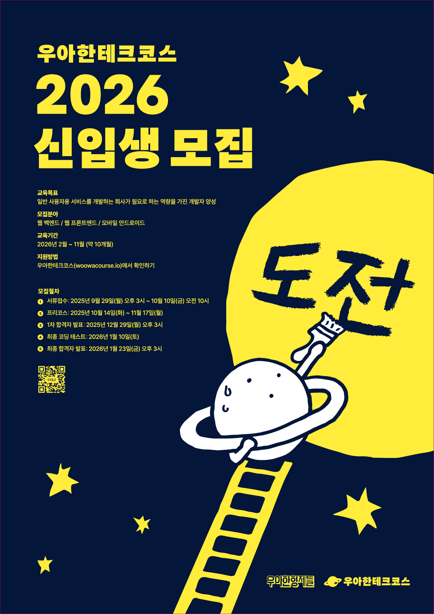

  

> 우아한테크코스에서 학습한 내용을 정리하는 저장소
>
>

    

## 🌱 Level 0 : 프리코스
### 기간
- 2025.10.14 ~ 2025.11.17

### 진행 미션
| 미션 | Repository | Pull Request | 주차 소감문 |
|:--:|:--:|:--:|:--:|
| 문자열 덧셈 계산기 | [java-calculator-8](https://github.com/MODUGGAGI/java-calculator-8/tree/MODUGGAGI) | [Pull Request](https://github.com/woowacourse-precourse/java-calculator-8/pull/819) | [1주차 소감문](https://cloudy-spandex-08a.notion.site/28c8b8b35dba80d8bad5e3f8546df75c) |
| 자동차 경주 | [java-racingcar-8](https://github.com/MODUGGAGI/java-racingcar-8/tree/MODUGGAGI) | [Pull Request](https://github.com/woowacourse-precourse/java-racingcar-8/pull/591) | [2주차 소감문](https://cloudy-spandex-08a.notion.site/2958b8b35dba805f925cfc33ec13f9b4?source=copy_link) |
| 로또 | [java-lotto-8](https://github.com/MODUGGAGI/java-lotto-8/tree/MODUGGAGI) | [Pull Request](https://github.com/woowacourse-precourse/java-lotto-8/pull/352) | [3주차 소감문](https://cloudy-spandex-08a.notion.site/29b8b8b35dba8072812bfdafed65d5fe?source=copy_link) |
| 오픈 미션 | [Refactoring a Monolith to Spring Modulith](https://github.com/woowacourse-checkmo/BE_WOOWA/tree/refactor/1/SpringModulith) | - | [오픈미션 소감문](https://cloudy-spandex-08a.notion.site/2b58b8b35dba8014bb10f073aab5e31f?source=copy_link) |
---

## 🚀 Level 1
### 기간
- 2026.02.24 ~ 2026.04.17

### 학습 목표
- 자바 프로그래밍 언어에 대한 핵심 개념을 익혀 프로그래밍하는 경험을 한다. 
- 읽기 좋은 코드를 구현하는 것이 왜 중요한지와 코드를 개선해 읽기 좋은 코드로 변경해 보는 경험을 한다. 
- 자신이 구현한 코드에 대해 단위 테스트와 리팩토링하는 경험을 한다. 
- 데이터베이스를 활용한 콘솔 애플리케이션을 개발하는 경험을 한다.

### 진행 미션
| 미션 | Repository | Pull Request | Pair | Reviewer |
|:--:|:--:|:--:|:--:|:--:|
| Gemini Canvas 웹앱 만들기 | [gemini-canvas_web-app](https://github.com/MODUGGAGI/gemini-canvas-mission/tree/MODUGGAGI) | [Pull Request](https://github.com/woowacourse/gemini-canvas-mission/pull/76) | [도우너](https://github.com/Soojin6943) | [영이](https://github.com/choijy1705) |
